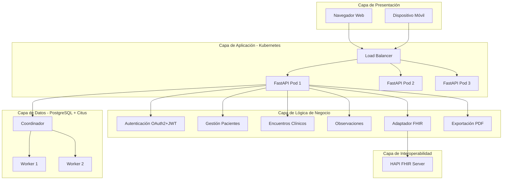
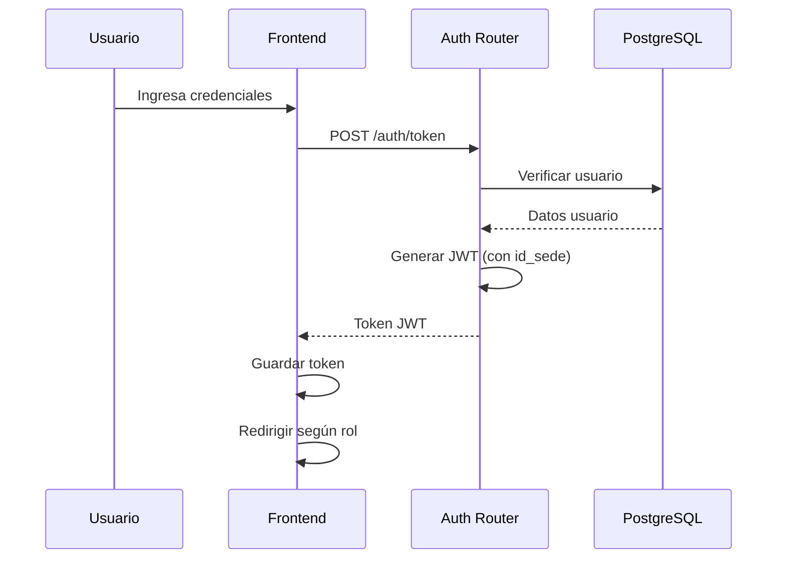
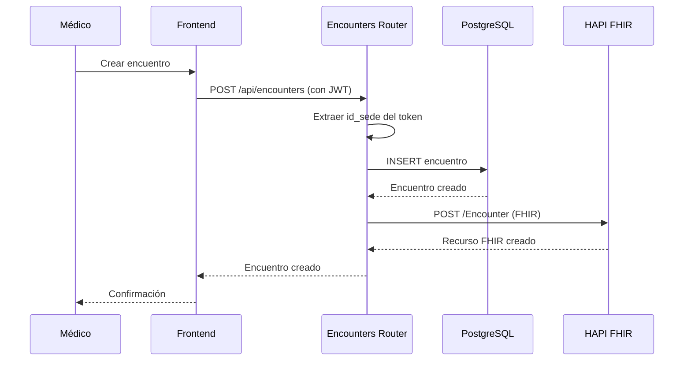
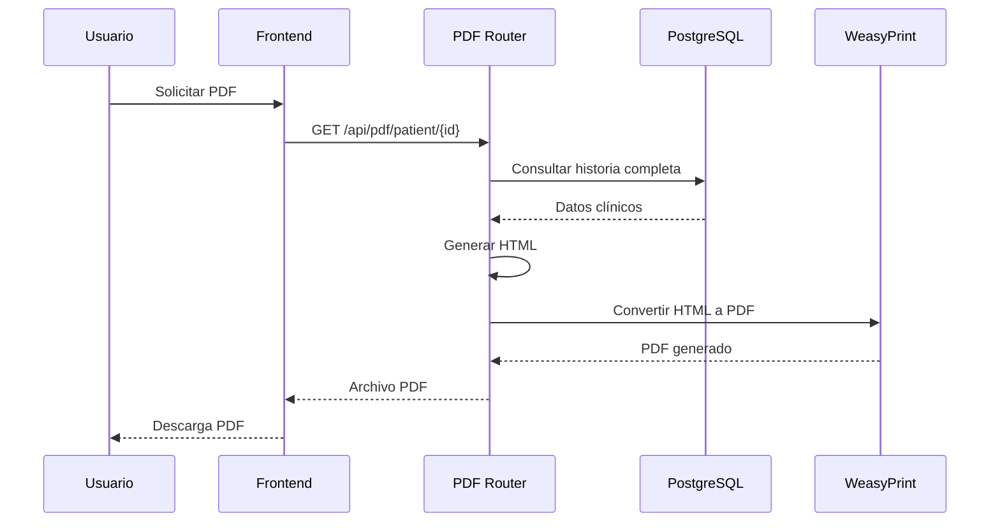

# Arquitectura del Sistema HCE Interoperable

## Visión General

El Sistema de Historia Clínica Electrónica (HCE) Interoperable es una solución multisede que integra estándares internacionales de salud (HL7 FHIR) con una arquitectura moderna basada en microservicios, bases de datos distribuidas y orquestación de contenedores.

## Diagrama de Arquitectura



## Componentes Principales

### 1. Frontend (HTML + Jinja2 + JavaScript)

**Responsabilidades:**
- Renderizado de interfaces por rol
- Gestión de autenticación JWT
- Comunicación con API REST
- Visualización de datos FHIR

**Interfaces:**
- **Paciente**: Consulta de historia clínica y descarga PDF
- **Admisionista**: Registro y gestión de pacientes
- **Médico**: Creación de encuentros y registro clínico
- **Historificación**: Búsqueda y exportación de historias

### 2. Middleware FastAPI

**Responsabilidades:**
- Exposición de API REST
- Autenticación y autorización
- Lógica de negocio
- Transformación FHIR ↔ SQL
- Generación de PDFs

**Routers:**
- `/auth` - Autenticación OAuth2
- `/api/patients` - Gestión de pacientes
- `/api/encounters` - Encuentros clínicos
- `/api/observations` - Observaciones clínicas
- `/fhir/*` - Recursos FHIR
- `/api/pdf/*` - Exportación PDF

### 3. Base de Datos PostgreSQL + Citus

**Responsabilidades:**
- Almacenamiento de datos clínicos
- Distribución horizontal de datos
- Replicación de tablas de referencia

**Estrategia de Distribución:**
- **Tablas Distribuidas** (por `id_paciente`):
  - `pacientes`
  - `encuentros_clinicos`
  - `observaciones_clinicas`
  - `diagnosticos`
  - `medicamentos`
  - `alergias`

- **Tablas de Referencia** (replicadas):
  - `sedes`
  - `usuarios`

### 4. Servidor HAPI FHIR

**Responsabilidades:**
- Almacenamiento de recursos FHIR
- Validación de recursos FHIR
- API REST FHIR estándar
- Búsqueda de recursos

**Recursos Soportados:**
- Patient
- Observation
- Encounter
- Condition
- MedicationRequest

### 5. Kubernetes

**Responsabilidades:**
- Orquestación de contenedores
- Escalado automático
- Alta disponibilidad
- Gestión de configuración

**Recursos:**
- Deployment: 3 réplicas del middleware
- Service: LoadBalancer para acceso externo
- ConfigMap: Configuración de aplicación
- Secret: Credenciales sensibles

## Flujo de Datos

### Flujo de Autenticación



### Flujo de Creación de Encuentro Clínico



### Flujo de Exportación PDF



## Estrategia Multisede

### Contexto de Sede en JWT

Cada token JWT contiene:
```json
{
  "sub": "doctor1",
  "rol": "medico",
  "id_sede": 1,
  "id_usuario": 4,
  "exp": 1234567890
}
```

### Filtrado por Sede

**Backend:**
- Todos los endpoints extraen `id_sede` del token
- Las consultas SQL filtran automáticamente por sede
- Los datos muestran el origen (sede) de cada registro

**Frontend:**
- Badge visual muestra la sede activa
- Colores diferenciados por sede:
  - Bogotá: Rojo
  - Medellín: Azul
  - Cali: Verde

### Historia Clínica Única Unificada (HCEU)

- Un paciente puede tener encuentros en múltiples sedes
- Cada encuentro registra la sede de origen
- La historia clínica consolida todos los encuentros
- El PDF muestra visualmente la sede de cada registro

## Interoperabilidad FHIR

### Mapeo SQL → FHIR

| Tabla SQL | Recurso FHIR | Códigos Estándar |
|-----------|--------------|------------------|
| `pacientes` | Patient | - |
| `encuentros_clinicos` | Encounter | ActCode |
| `observaciones_clinicas` | Observation | LOINC |
| `diagnosticos` | Condition | ICD-10, SNOMED CT |
| `medicamentos` | MedicationRequest | - |

### Transformación Bidireccional

**SQL → FHIR:**
- Funciones `sql_to_fhir_*()` en `fhir_adapter.py`
- Mapeo de campos relacionales a recursos JSON
- Inclusión de códigos estándar

**FHIR → SQL:**
- Funciones `fhir_to_sql_*()` (futuro)
- Extracción de datos de recursos FHIR
- Almacenamiento en modelo relacional

## Seguridad

### Capas de Seguridad

1. **Autenticación**: OAuth2 Password Flow con JWT
2. **Autorización**: Validación de roles en cada endpoint
3. **Contexto de Sede**: Filtrado automático por sede
4. **Encriptación**: Contraseñas hasheadas con bcrypt
5. **Expiración**: Tokens con TTL de 30 minutos
6. **CORS**: Configurado para orígenes permitidos

### Políticas de Acceso por Rol

| Rol | Pacientes | Encuentros | Observaciones | PDF | FHIR |
|-----|-----------|------------|---------------|-----|------|
| Paciente | Solo propios | Solo propios | Solo propios | ✓ | ✗ |
| Admisionista | Sede | Sede | ✗ | ✗ | ✗ |
| Médico | Sede | Crear/Ver | Crear/Ver | ✓ | ✓ |
| Historificación | Todos | Todos | Todos | ✓ | ✓ |

## Escalabilidad

### Escalado Horizontal

- **Middleware**: 3+ réplicas en Kubernetes
- **Base de Datos**: Distribución Citus con múltiples workers
- **HAPI FHIR**: Puede escalarse independientemente

### Distribución de Datos

- Sharding por `id_paciente` (32 shards)
- Colocation de datos relacionados
- Tablas de referencia replicadas

## Monitoreo y Observabilidad

### Health Checks

- **Liveness Probe**: `/health` cada 10s
- **Readiness Probe**: `/health` cada 5s

### Logs

- Logs estructurados en JSON
- Trazabilidad de requests con correlation ID
- Logs de auditoría de acceso a datos

## Decisiones Técnicas

### ¿Por qué PostgreSQL + Citus?

- Soporte nativo para datos relacionales
- Distribución horizontal sin cambiar queries
- Transacciones ACID
- Extensibilidad con Citus

### ¿Por qué FastAPI?

- Alto rendimiento (async/await)
- Validación automática con Pydantic
- Documentación automática (OpenAPI)
- Type hints nativos

### ¿Por qué HAPI FHIR?

- Implementación de referencia de FHIR
- Validación automática de recursos
- API REST estándar
- Comunidad activa

### ¿Por qué Kubernetes?

- Orquestación de contenedores
- Escalado automático
- Alta disponibilidad
- Gestión declarativa

## Limitaciones Conocidas

1. **Citus**: Limitaciones en JOINs complejos entre tablas distribuidas
2. **WeasyPrint**: Puede ser lento para PDFs muy grandes
3. **HAPI FHIR**: Requiere recursos significativos de memoria
4. **Sincronización FHIR**: Actualmente manual, no automática

## Mejoras Futuras

1. Sincronización automática con HAPI FHIR
2. Cache de recursos FHIR frecuentes
3. Notificaciones en tiempo real (WebSockets)
4. Búsqueda avanzada con Elasticsearch
5. Auditoría completa de acciones
6. Integración con sistemas externos (laboratorios, imágenes)
